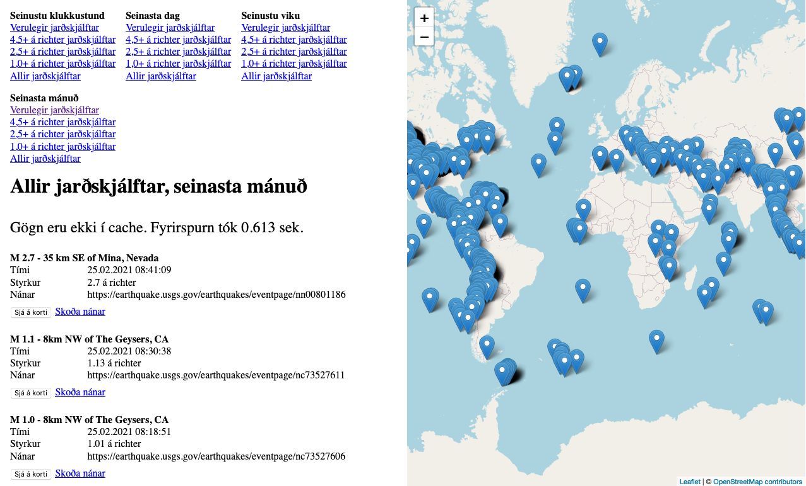

# Vefforritun 2, 2021, verkefni 4

[Verkefnið byggir á verkefni 9 í vefforritun 1, 2020](https://github.com/vefforritun/vef1-2020-v9-synilausn).

[Kynning á verkefni](https://youtu.be/U8K0m9zRxHk).

Bæta skal við server sem situr á milli beiðna frá client til USGS (proxyar beiðnir), þessi proxy notar redis til að cache gögn á milli fyrirspurna.

Einnig skal bæta við möguleikum á að sækja öll gögn eftir tímabili og stærðargráðu, í `index.html` er búið að setja upp lista af tenglum á hverja týpu. Útfæra þarf virkni í framenda sem sækir rétt gögn gegnum proxy þjónustu. Beiðnir á proxy þjónustu ættu að taka við querystring breytum, t.d. `/proxy?period=hour&type=significant` og skila gögnum ásamt auka lýsigögnum um fyrirspurn.

### Lýsigögn um fyrirspurn

Lýsigögn um fyrirspurn innihalda tvö gildi:

* Hvort gögn hafi verið sótt úr cache eða ekki
* Hversu lengi tók að sækja gögn í sekúndum (hvort heldur sem er úr cache eða með fetch), sjá `./src/time.js`

Formið á þeim ætti að vera:

```javascript
{
  data, // gögn um jarðskjálfta
  info: {
    cached: true,
    elapsed: 0.500,
  },
};
```

Gögnin skal síðan birta á framenda.



### Fetch

Bæði framendi (client) og bakendi (server) munu gera `fetch` köll og mikilvægt er að gera sér fulla grein á muninn á þeim.

Kóði fyrir framenda er í `./client`, kóði fyrir bakenda er í `./src`.

Framendi á proxy þjónustu bakenda, og bakendi á USGS þjónustu, ef gögn eru ekki í cache.

## Tæki og tól

Gefinn er grunnur, byggður á sýnilausn á verkefni 9 úr vef1. Búið að tengja saman browser-sync og nodemon þ.a. `npm run dev` virkar sem skildi. Það er gert með því að nota browser-sync sem proxy á server sem keyrir þá á port 3001.

Nota skal `node-fetch` á bakenda.

Setja skal upp `redis` og nota til að cachea gögn.

Setja skal verkefnið upp á Heroku með cache virkni.
## Mat

* 20% – Bakenda virkni sett upp og virkar með gefinni framenda virkni
* 30% – Proxy virkni á bakenda sett upp og notar redis
* 30% – Viðbætur á framenda til að geta sótt gögn gegnum proxy
* 20% – Verkefni sett upp á Heroku með cache virkni

## Sett fyrir

Verkefni sett fyrir í fyrirlestri fimmtudaginn 25. febrúar 2021.

## Skil

Skila skal í Canvas í seinasta lagi fyrir lok dags laugardaginn 13. mars 2021.

Skilaboð skulu innihalda slóð á Heroku og slóð á GitHub repo fyrir verkefni, og dæmatímakennurum skal hafa verið boðið í repo ([sjá leiðbeiningar](https://docs.github.com/en/free-pro-team@latest/github/setting-up-and-managing-your-github-user-account/inviting-collaborators-to-a-personal-repository)). Notendanöfn þeirra eru:

* `jonnigs`
* `mimiqkz`
* `Steinalicious`
* `zurgur`

Hver dagur eftir skil dregur verkefni niður um 10%, allt að 20% ef skilað mánudaginn 15. mars 2021 en þá lokar fyrir skil.

## Einkunn

Sett verða fyrir 6 minni verkefni þar sem 5 bestu gilda 8% hvert, samtals 40% af lokaeinkunn.

Sett verða fyrir tvö hópverkefni þar sem hvort um sig gildir 10%, samtals 20% af lokaeinkunn.

---

> Útgáfa 0.1
